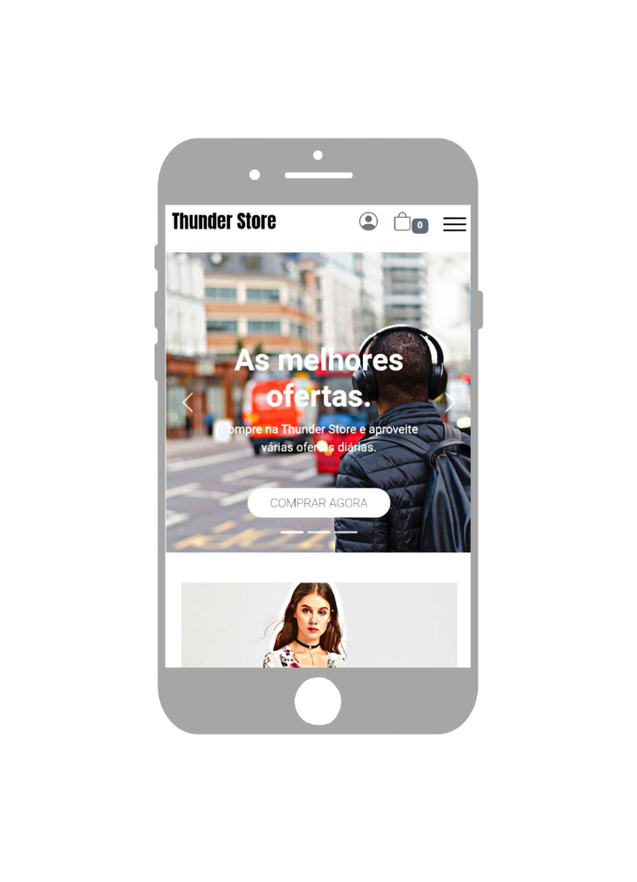
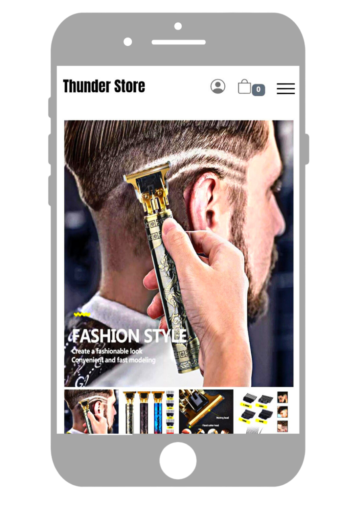
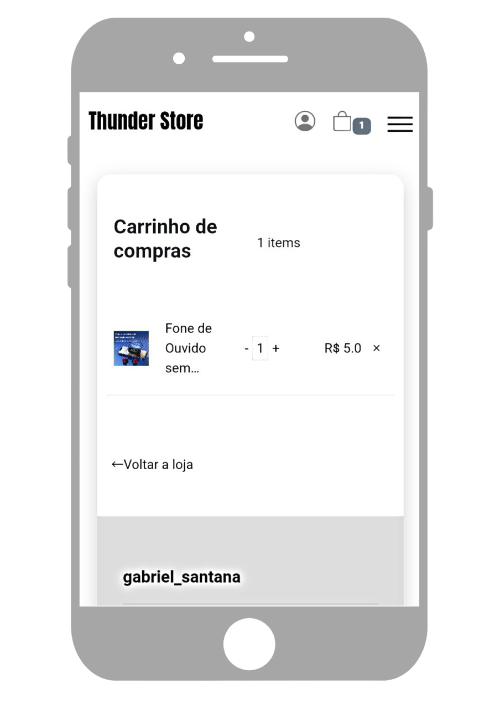
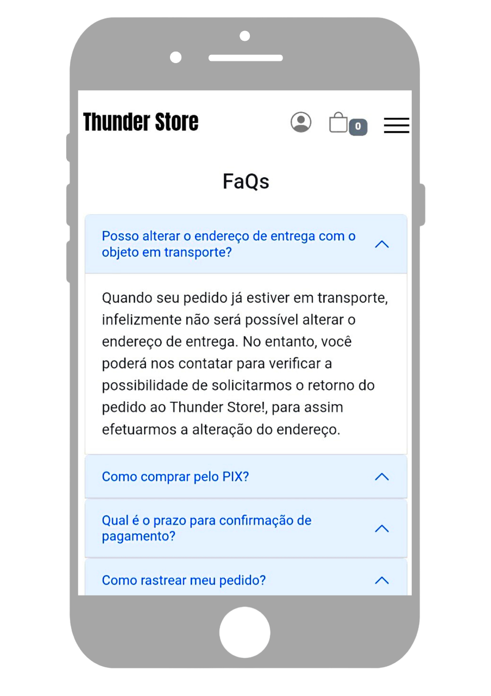
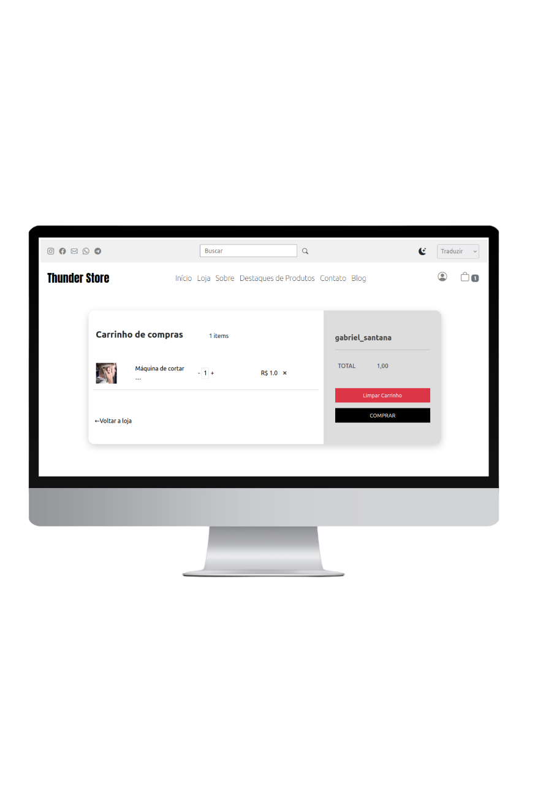
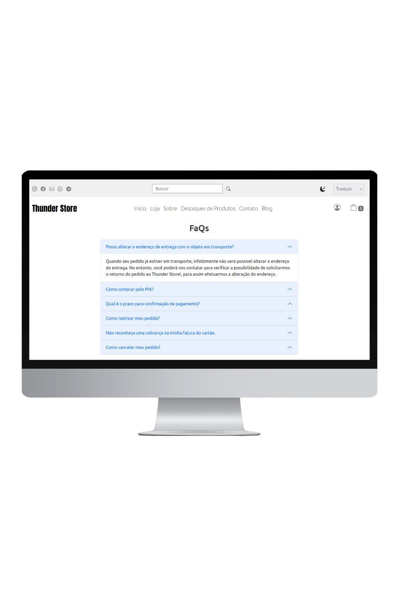

<h1 align="center"> ⭐ Thunder Store </h1>

   ⭐ This README covers all the specifics of the Thunder Store system.

  <a href="#introduction"> 🧩 Introduction </a>&nbsp;&nbsp;&nbsp;|&nbsp;&nbsp;&nbsp;
  <a href="#results"> 🚀 Results</a>&nbsp;&nbsp;&nbsp;|&nbsp;&nbsp;&nbsp;
  <a href="#dependencies"> 🧪 Dependencies</a>&nbsp;&nbsp;&nbsp;|&nbsp;&nbsp;&nbsp;
  <a href="#idea">💡 Possible Improvements</a>&nbsp;&nbsp;&nbsp;|&nbsp;&nbsp;&nbsp;
  <a href="#credits"> 🏆 Credits </a>&nbsp;&nbsp;&nbsp;&nbsp;&nbsp;&nbsp;

 

## 🧩 Introduction

  ***⠀⠀⠀⠀⭐ Thunder Store, an e-commerce project with safe, clean and open code for anyone who wants to use it. In the future I intend to use it to make my sales, for this reason I have often been implementing new features and improvements to the system.***

 ⭐ name | ⭐ technology
|---|---|
Front-End | 
Back-End | 
Others | Vim, Stripe, Docker, Google Analytics.
 

## 🚀 Results
  > All results were successfully achieved. In general, these are the results of each request.

⭐ Name | ⭐ Link |
|---|---|
Home Page | https://thunderstore.up.railway.app/
Products Page | https://thunderstore.up.railway.app/produtos/
Featured Products | https://thunderstore.up.railway.app/#featured-products
About | https://thunderstore.up.railway.app/pagina/sobre/
Contact, Support | https://thunderstore.up.railway.app/pagina/contato/
Blog | https://thunderstore.up.railway.app/blog/
FaQ | https://thunderstore.up.railway.app/pagina/faqs/
Politic | https://thunderstore.up.railway.app/pagina/politica/
Track Order | https://thunderstore.up.railway.app/produto/rastreio/
Shopping Cart | https://thunderstore.up.railway.app/cart/cart-detail/
Login | https://thunderstore.up.railway.app/accounts/login/
Sign up | https://thunderstore.up.railway.app/accounts/signup/
  

## Screens

### 🤳🏻 Mobile

    

⭐ Home | ⭐ Product Detail | ⭐ Cart | ⭐ FaQ |
|---|---|---|---|
 | | | 
  
  

### 💻 Desktop 
  
 ⭐ Home | ⭐ Product Detail | ⭐ Cart | FaQ |
|---|---|---|---|
 |  |  | 
 
  

## 🧪 Dependencies
> Requirements to rotate the code.
- Docker
- docker-compose

<h4>Step-1</h4> <code>git clone link https://github.com/GabrielSantos198/ThunderStore</code>

<h4>Step-2</h4> Change the values of environment variables in the docker-compose.yml.  

Key | Value
|---|---|
DEBUG | True/False
SECRET_KEY | Application secret key
EMAIL_HOST_USER | Your Gmail
EMAIL_HOST_PASSWORD | Gmail app password
RECIPIENT_ADDRESS | Message receipt email
CLOUD_NAME | Your name in Cloudinary
API_KEY | Your API key on Cloudinary
API_SECRET | Your API secret on Cloudinary
STRIPE_PUBLISHABLE_KEY | Your publishable key on Stripe
STRIPE_SECRET_KEY | Your secret key on Stripe
STRIPE_ENDPOINT_SECRET | Your Secret Endpoint on Stripe
 

OBS:  
- Cloudinary is used to store media files. 
- Stripe allows you to make payments in the system. 
- I used a gmail app to receive e-commerce messages. 

<h4>Step-3</h4> After placing the values of the environment variables, just run the command: <code>docker-compose up</code> and the application will be available on port 9000. 
 

OBS: It is also possible to run the application without docker, just clone the repository, create an .env file in the root of the project with the necessary keys and values ​​and install the project dependencies in requirements.txt, however the use of docker is encouraged, for a construction with no chance of failure.

## 💡 Possible Improvements
> Possible code and design improvements if you want to go back and improve it.

 

  ### ***⠀⠀⠀⠀⭐ I believe that every project has things that can be improved, so here is an exclusive area for possible improvements or things that would be interesting to have in the project, but it will stay for the future.***

  

- [ ] ***- Test all code***
- [ ] ***- Add notification***
- [ ] ***- Add shipping calculator***
- [ ] ***- Add Change Password***

  

## 🏆 Credits

  ### ***⭐ For every project we have to give credits to the creators so nothing better than finishing with a golden key with the creators / creator of the project***.

  

 

| [  Gabriel Santana ](https://www.linkedin.com/in/gabrielsantana444) | ***Hello 😃 If you made it this far, I believe you liked my project, in which case we have something in common, so how about we talk a little? My call on linkedin*** 😁 |
|---|---|

 
